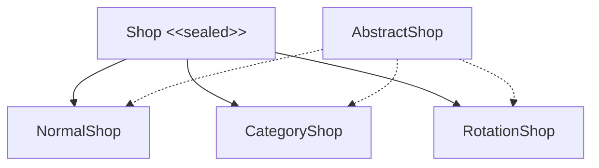

# UltraShop 🛒✨

**UltraShop** is a next-level shop system for Minecraft servers, designed to provide **dynamic, immersive, and fully
customizable shopping experiences**. Each shop is flexible, allowing server owners to create unique, event-driven, or
permanent stores for players.

---

## 🏷️ Key Features of Shops

### 1. Condition System ⚡

- Every shop integrates a **powerful condition system** powered by CobbleUtils.
- Controls **who can enter**, **when**, and under which rules.
- Conditions can include:
    - Time-based access ⏰ (hours, days, months)
    - Player-specific permissions 🧑‍💻
    - Event-specific access 🎉
    - Biome or environment-based access 🌍
- Allows shops to be **exclusive, temporary, or tied to special events**.

---

### 2. Shop Types 🏬

UltraShop supports **three main types of shops**:

1. **Normal Shop 🏪**
    - Displays all products in the shop.
    - Perfect for permanent or everyday items.

2. **Rotational Shop 🔄**
    - Products rotate automatically on schedules.
    - Rotations can depend on rarity, events, or time periods.
    - Ideal for **dynamic, limited-time, or special shops**.

3. **Catalog Shop 📚**
    - Organizes products into categories for easy browsing.
    - Each catalog can have its own **rotation, discounts, and stock rules**.
    - Helps players navigate large inventories efficiently.

---

### 3. Products & Limited Availability 🌟

- Each product can have **its own conditions** for availability.
- Products may be **temporarily unavailable** if conditions are not met, even when the shop is open.
- Examples of product-specific conditions:
    - Available only in certain **biomes** 🌵🏔️🌊
    - Only at certain **times of day or season** 🌞🌙❄️
    - Requires **special permissions** 🏅
    - Available only during **events or festivals** 🎉
- This allows for **rare, secret, or limited-edition products** without creating separate shops.
- Products automatically become available once conditions are met.

---

### 4. Multi-Currency Support 💰

- Products can require **multiple types of currency** to purchase.
- Players must have **all required currencies** to buy the product.
- Supports **complex economies**, premium items, and flexible pricing.
- Discounts can apply to **specific currencies** or **globally across all currencies**.

---

### 5. Discounts & Offers 🎁

- Discounts can be applied to:
    - Entire shop 🌍
    - Specific catalogs 📚
    - Individual products 🛍️
- Can depend on player permissions, events, or time-based conditions.
- Supports stacking, prioritization, and temporary promotions.
- Enables creative and strategic sales campaigns for players.

---

### 6. Player Navigation & GUI 🎮

- Intuitive navigation between shops, catalogs, and products.
- Supports **forward/backward navigation** and easy browsing.
- Fully compatible with opening shops via commands.
- Optional features:
    - Favorite products ⭐
    - Bookmarks or recently viewed items
    - Category filters or tabs for better organization

---

### 7. Purchase Tracking & Player History 📊

- Each product has a **unique identifier** (`productId`) for tracking purposes.
- Player purchases are recorded with:
    - Player ID 🧑‍💻
    - Product ID 🌟
    - Quantity and currencies used 💰
    - Date/time of purchase ⏰
- Enables features like:
    - Viewing purchase history 📜
    - Limiting quantity per player 🚫
    - Rewarding loyal players 🎁
    - Analytics for server economy 📊
- Integrates seamlessly with conditions and discounts.

---

### 8. Flexibility & Customization 🌈

UltraShop is designed to be **hyper-customizable**:

- Add **new shop types or subtypes** without code changes.
- Configure **rotations, stock, and rare items**.
- Set **access conditions** for shops, catalogs, and individual products.
- Apply **discounts globally, per catalog, or per product**.
- Integrate **multiple currencies** for complex pricing.
- Track player purchases for analytics and rewards 📊
- Create **VIP shops or event-exclusive stores**.
- Modify GUI appearance with colors, icons, or tabs.
- Enable **dynamic pricing**, combo offers, or limited edition items.
- Design shops to be **event-driven, exploration-focused, or rank-based**.

---

### 9. Additional Ideas & Inspiration 💡

- **Event Shops**: Open only during holidays or server events 🎃🎄
- **Limited Edition Items**: Rare products that appear only under certain conditions 🌟
- **Dynamic Pricing**: Prices change depending on stock, player rank, or time ⏱️
- **Player-Specific Shops**: Personalized inventories per player 🧑‍💻
- **Promotions & Combos**: Special discounts when buying multiple items together 🛍️
- **Custom GUI Themes**: Color-coded categories, icons, and tabs for visual clarity 🎨
- **Exploration Rewards**: Encourage players to explore biomes or complete objectives to unlock products 🌍🏔️

---

**UltraShop** is built to provide **players with rich, dynamic shopping experiences**, while giving server owners **full
control over shop behavior, products, rotations, discounts, currencies, conditions, and purchase tracking**. 🛒✨

---

## 🏗️ Technical Architecture & Design System

UltraShop is built using modern software engineering practices, prioritizing the **Single Responsibility Principle (SRP)**, **Polymorphism**, and **Immutable Value Objects (VOs)**.

### 1. Shop Domain Hierarchy
Instead of a monolithic "god-class" representing every shop type, UltraShop utilizes a Java **sealed interface** hierarchy:

- **`Shop`**: Sealed interface root defining common visual and lifecycle query methods.
- **`AbstractShop`**: Reusable base class holding common fields and default configurations.
- **`NormalShop`**: Static catalog implementation, displaying a permanent list of `Product`s.
- **`CategoryShop`**: Navigation hub carrying links to sub-shops (`SubShop`) rather than products.
- **`RotationShop`**: Dynamic scheduler-driven catalog selecting a subset of products from a pool on schedule tick.

To perform operations across this hierarchy, we employ the **Visitor Pattern** (`ShopVisitor`), guaranteeing compile-time exhaustiveness checks whenever a new shop type is added.

---

### 2. Configuration Value Objects (VOs)
Each shop delegates specific aspects of its configuration to immutable Value Objects. This isolates configuration concerns and makes the model highly reusable:

1. **`DisplayConfig`**: Visual/layout options including name, GUI rows, auto-placement region (`Rectangle`), panels, and close/back/next icon item definitions.
2. **`EconomyConfig`**: Currency mapping. Contains a set of accepted `EconomyUse` definitions, global discounts, and permission-keyed discounts.
3. **`ConditionsConfig`**: Lifecycle predicates (`Condition`) governing when a shop can be opened, what console commands run on exit, and whether rotation notifications are enabled.
4. **`SoundConfig`**: Cues played when the shop opens or closes.

---

### 3. Polymorphic Schedulers
For `RotationShop` scheduling, we abstract the timing engine behind the sealed `Scheduler` interface:

- **`DurationScheduler`**: Fires at simple human-readable intervals (e.g. `"30m"`, `"1h"`, `"2d"`) using CobbleUtils' `DurationValue` parsing.
- **`CronScheduler`**: Fires on aligned wallclock schedules using Unix cron expressions (e.g. `"0 * * * *"` for top-of-the-hour, `"0 0 * * 0"` for midnight Sunday).

---

### 4. Serialization & Backwards Compatibility Layer
To prevent breaking legacy JSON configurations, UltraShop implements a transparent GSON adapter layer:

- **`ShopTypeConverter`**: Automatically deserializes old flat-format JSON files and bridges them into the structured polymorphic hierarchy.
- **Auto-Migration**: Upon loading a legacy shop config, the loader automatically converts the data to the typed hierarchy and rewrites it to disk.
- **Shim Layer (`ShopBridge`)**: Translates concrete typed shops back to legacy views on-the-fly where legacy integrations still exist. This allows a phased migration of the rest of the codebase without regression.